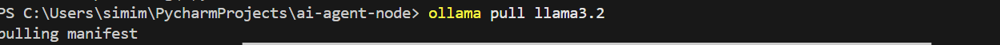
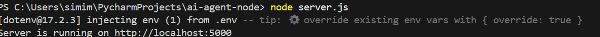

# AI Chat Agent

A local AI chatbot built with Node.js, Express, and Ollama, featuring:

#### Real-time streaming responses (word-by-word typing like ChatGPT)
#### Markdown-formatted answers 
#### Simple and responsive web chat UI
#### Fully local — no external API costs

## Installation & Setup
Prerequisites:

Install Node.js + Express

Ollama — Install from Ollama.ai

## Run the server
Before running pull the model from Ollama

Run the server 

Run on localhost: 
http://localhost:5000/

## Future work & Improvemnets

Node.js state management and  local storage for the chat history to persistbefore refreshing the page.

Using modern frontend frameworks for UI design

